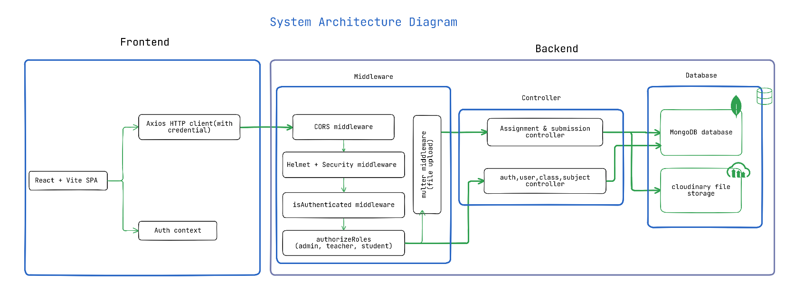
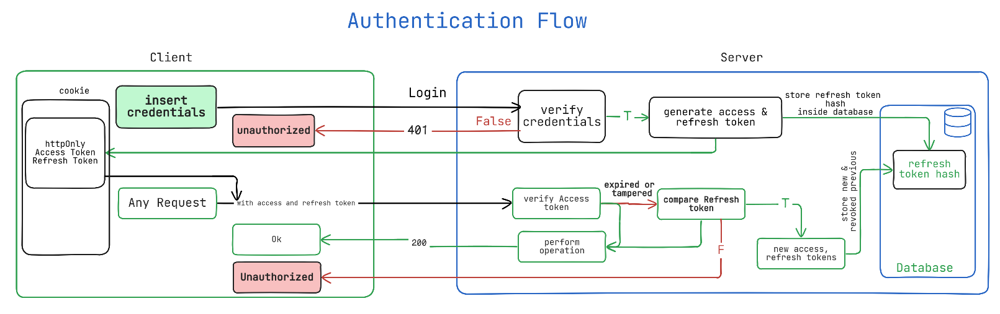
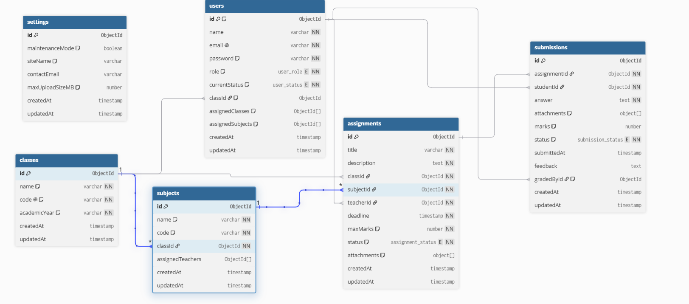

# OnnoRokom LMS: Assignment and Submission Management System

> live link https://onnorokomlms.netlify.app/

A role-based learning management system built for schools and colleges. It handles the full assignment lifecycle, from creation and publishing to submission, file upload, and grading, across three user roles: Admin, Teacher, and Student.

---

## Table of Contents

- [Overview](#overview)
- [Key Features](#key-features)
- [System Architecture](#system-architecture)
- [Authentication Flow](#authentication-flow)
- [Database Design](#database-design)
- [Design Decisions](#design-decisions)
- [Technology Stack](#technology-stack)
- [Project Structure](#project-structure)
- [Local Setup](#local-setup)
- [Unit Testing](#unit-testing)
- [Demo Credentials](#demo-credentials)
- [Environment Variables](#environment-variables)
- [API Reference](#api-reference)
- [Assumptions and Limitations](#assumptions-and-limitations)
- [Future Improvements](#future-improvements)
- [Technology Note](#technology-note)

---

## Overview

The system is designed around three distinct roles, each with its own set of responsibilities and a dedicated dashboard.

**Admin** is responsible for setting up and maintaining the platform. This includes approving or suspending user accounts, creating classes and subjects, assigning teachers to relevant subjects, and managing system-level settings like maintenance mode.

**Teacher** can create assignments for specific classes and subjects, attach reference files (PDF, DOCX, or images), and control whether an assignment is published or saved as a draft. Once students submit their work, the teacher can review each submission and provide marks along with written feedback.

**Student** sees only the assignments published for their enrolled class. They can submit a written answer along with an optional file attachment, update their submission before it is graded, and check their results once the teacher grades their work.

---

## Key Features

- Role-based authentication and authorization
- Admin-controlled account approval
- Class and subject management
- Teacher-to-subject assignment
- Assignment creation, editing, publishing, and deletion
- Draft and published assignment states
- Assignment file attachments
- Student submission and resubmission
- Teacher grading and written feedback
- Cloudinary-based file storage
- HTTP-only cookie-based authentication
- Request throttling and HTTP security headers
- Automated backend API tests

---

## System Architecture



---

## Authentication Flow



---

## Database Design

The interactive entity relationship diagram for the MongoDB database schema is available on dbdiagram.io:

[View Interactive Database ER Diagram on dbdiagram.io](https://dbdiagram.io/d/olmsdbdiagram-6a7efbd3e093539a9eb85c8d)



---

## Design Decisions

### JWT Authentication with HTTP-only Cookies

JWT-based authentication is used to maintain authenticated sessions, while HTTP-only cookies prevent client-side JavaScript from directly accessing the authentication tokens.

### Backend-enforced RBAC

Role checks are handled by backend middleware rather than relying only on frontend route protection. This keeps authorization at the API boundary and prevents users from bypassing permissions by calling protected endpoints directly.

### MongoDB with Mongoose

MongoDB fits the application's document-oriented data model. Mongoose provides schemas, validation, relationships, and a consistent data-access layer.

### Cloudinary for File Storage

Multer uses memory storage for incoming files, which are then streamed to Cloudinary. This keeps temporary uploaded files off the application server and separates file storage from application data.

### Draft and Published Assignments

Assignments support a draft/published lifecycle so teachers can prepare work without exposing unfinished assignments to students.

### Submission Lifecycle

Students can submit or resubmit work before grading. Once a submission has been graded, it is no longer editable through the normal student submission workflow.

---

## Technology Stack

**Frontend**

- React 19 with Vite 8 as the build tool
- TailwindCSS 4 for styling
- React Router 7 for client-side routing
- Axios for HTTP requests
- Lucide React for icons

**Backend**

- Node.js with ES Modules
- Express 5
- Mongoose 9 for MongoDB object modeling
- JSON Web Tokens for authentication
- bcrypt for password hashing
- Helmet for HTTP security headers
- express-rate-limit for request throttling
- express-mongo-sanitize for NoSQL injection prevention
- Multer with memory storage for file handling
- Streamifier for streaming file buffers to Cloudinary
- Vitest and Supertest for unit testing

**Database**

- MongoDB Atlas (cloud-hosted)

**File Storage**

- Cloudinary stores assignment attachments and student submission files, with proper extension preservation for PDFs and documents

---

## Project Structure

```text
onnorokomlms/
├── backend/
│   ├── app.js                  # Express setup, middleware chain, and route binding
│   ├── index.js                # Server entry point and database connection
│   ├── configs/                # Cloudinary, cookie, and MongoDB configuration
│   ├── controllers/            # Business logic for application resources
│   ├── middlewares/            # Authentication, authorization, and file upload
│   ├── models/                 # Mongoose schemas
│   ├── routes/                 # Express route definitions
│   ├── tests/                  # Vitest and Supertest test suite
│   └── utils/                  # Logger and Cloudinary upload helpers
└── frontend/
    └── src/
        ├── contexts/           # Authentication context and session state
        ├── pages/              # Login, registration, and role-based dashboards
        ├── components/         # Reusable UI and layout components
        └── services/           # Axios instance and API configuration
```

---

## Local Setup

**Prerequisites**

- Node.js v18 or higher
- npm v9 or higher
- A MongoDB Atlas cluster or a local MongoDB instance
- A Cloudinary account (free tier is fine for development)

**Backend**

```bash
cd backend
npm install
cp .env.example .env
npm run dev
```

The server starts at `http://localhost:3000`. Make sure to fill in the environment variables before running.

**Database**

No manual collection creation is required. Mongoose creates the required collections and indexes when the application connects to MongoDB.

**Frontend**

```bash
cd frontend
npm install
npm run dev
```

The client starts at `http://localhost:5173`.

---

## Unit Testing

Backend unit testing is powered by **Vitest** and **Supertest**. Tests run against mock database models to verify API endpoints, status codes, and error handlers without needing an active database connection.

To run the unit test suite:

```bash
cd backend
npm test
```

This runs all test files in `backend/tests/` and prints the coverage summary.

---

## Demo Credentials

| Role    | Email             | Password         |
| ------- | ----------------- | ---------------- |
| Admin   | admin@oschool.com | admin123         |
| Teacher | fz@olms.com       | fz@olms.com      |
| Student | shamim@gmail.com  | shamim@gmail.com |

**Setting up the first admin on a fresh database**

There is no self-registration flow for admins. If you are starting with an empty database, insert the following document directly into the `users` collection in MongoDB:

```json
{
  "name": "System Administrator",
  "email": "admin@oschool.com",
  "password": "$2b$10$IeC/4Z2b/2yiCgvz1rLhPewojLIQuC2YfVzewYdIF.QbfswMPNxQy",
  "role": "admin",
  "currentStatus": "approved"
}
```

The password hash above corresponds to `admin123`. Once logged in, the admin can approve other registered accounts from the User Management panel.

---

## Environment Variables

**Backend (`backend/.env`)**

```env
MONGODB_URI="mongodb+srv://<username>:<password>@<cluster>.mongodb.net/onnorokomlms"
CLIENT_URL="http://localhost:5173"

ACCESS_TOKEN_SECRET="replace_with_a_long_random_string"
REFRESH_TOKEN_SECRET="replace_with_a_different_long_random_string"

CLOUDINARY_CLOUD_NAME="your_cloud_name"
CLOUDINARY_API_KEY="your_api_key"
CLOUDINARY_API_SECRET="your_api_secret"
```

**Frontend (`frontend/.env`)**

```env
VITE_API_BASE_URL="http://localhost:3000/api"
```

---

## API Reference

The API follows RESTful conventions. Protected endpoints are secured by backend authentication and role-based authorization middleware.

### Authentication

| Method | Endpoint             | Access        | Description                                  |
| ------ | -------------------- | ------------- | -------------------------------------------- |
| `POST` | `/api/auth/register` | Public        | Register a new account                       |
| `POST` | `/api/auth/login`    | Public        | Authenticate and receive an HTTP-only cookie |
| `POST` | `/api/auth/logout`   | Authenticated | Clear the session cookie                     |
| `GET`  | `/api/auth/me`       | Authenticated | Get the current authenticated user           |

### User Management

**Admin only**

| Method   | Endpoint                | Description                                            |
| -------- | ----------------------- | ------------------------------------------------------ |
| `GET`    | `/api/users`            | List all users                                         |
| `PUT`    | `/api/users/:id`        | Update a user's profile, class, or subject assignments |
| `PATCH`  | `/api/users/:id/status` | Approve or suspend a user                              |
| `DELETE` | `/api/users/:id`        | Remove a user                                          |

### Classes

| Method   | Endpoint           | Access        | Description    |
| -------- | ------------------ | ------------- | -------------- |
| `GET`    | `/api/classes`     | Authenticated | List classes   |
| `POST`   | `/api/classes`     | Admin         | Create a class |
| `PUT`    | `/api/classes/:id` | Admin         | Edit a class   |
| `DELETE` | `/api/classes/:id` | Admin         | Delete a class |

### Subjects

| Method | Endpoint                            | Access        | Description                     |
| ------ | ----------------------------------- | ------------- | ------------------------------- |
| `GET`  | `/api/subjects`                     | Authenticated | List subjects, filtered by role |
| `POST` | `/api/subjects`                     | Admin         | Create a subject                |
| `PUT`  | `/api/subjects/:id`                 | Admin         | Edit a subject                  |
| `PUT`  | `/api/subjects/:id/assign-teachers` | Admin         | Assign teachers to a subject    |

### Assignments

| Method   | Endpoint               | Access        | Description                                  |
| -------- | ---------------------- | ------------- | -------------------------------------------- |
| `GET`    | `/api/assignments`     | Authenticated | List assignments according to role and class |
| `POST`   | `/api/assignments`     | Teacher       | Create an assignment with an optional file   |
| `PUT`    | `/api/assignments/:id` | Teacher       | Edit an assignment or replace its file       |
| `DELETE` | `/api/assignments/:id` | Teacher       | Delete an assignment and its Cloudinary file |

### Submissions

| Method | Endpoint                     | Access        | Description                                        |
| ------ | ---------------------------- | ------------- | -------------------------------------------------- |
| `GET`  | `/api/submissions`           | Authenticated | List submissions according to role                 |
| `POST` | `/api/submissions`           | Student       | Submit or resubmit an answer with an optional file |
| `PUT`  | `/api/submissions/:id/grade` | Teacher       | Grade a submission with marks and feedback         |

### Settings

| Method | Endpoint        | Access        | Description              |
| ------ | --------------- | ------------- | ------------------------ |
| `GET`  | `/api/settings` | Authenticated | Get platform settings    |
| `PUT`  | `/api/settings` | Admin         | Update platform settings |

---

## Assumptions and Limitations

### Assumptions

The project assumes a school or college environment where users are known to the institution.

Because of this:

- Registration does not require email verification.
- New accounts are reviewed and approved by an administrator.
- Administrators are not created through public registration.
- File attachments are optional for both assignments and submissions.

If Cloudinary is not configured, the core LMS functionality remains available, but file upload functionality will not work.

### Known Limitations

#### Real-time updates

The current implementation does not use WebSockets. The UI refreshes data through API calls after relevant actions or when users switch views.

A WebSocket-based notification layer could be added later for instant grade updates and live notifications.

#### Pagination

Pagination is not currently implemented on the frontend or backend.

For larger deployments, list endpoints should support server-side pagination, filtering, and sorting to avoid loading unnecessarily large datasets.

#### File attachments

The current workflow supports one file attachment per assignment and one per submission. The schema already uses an array-based attachment structure, so supporting multiple files would require extending the upload and UI workflows.

---

## Future Improvements

Possible next steps for the system include:

- Server-side pagination, filtering, and sorting
- Real-time notifications using WebSockets
- Email notifications for assignments and grading
- Swagger/OpenAPI documentation
- Expanded unit and integration test coverage
- Audit logging for sensitive administrative actions
- Docker-based deployment
- Production monitoring and centralized observability
- More granular permission management

---

## Technology Note

This implementation uses **Node.js and Express** for the backend.

The assignment allows equivalent technologies, and the project applies the same core backend concepts expected from a modern web API: RESTful endpoints, middleware-based request processing, authentication, role-based authorization, validation, error handling, logging, database access, and automated testing.

The backend framework can be changed without changing the application's core architecture or business requirements.
